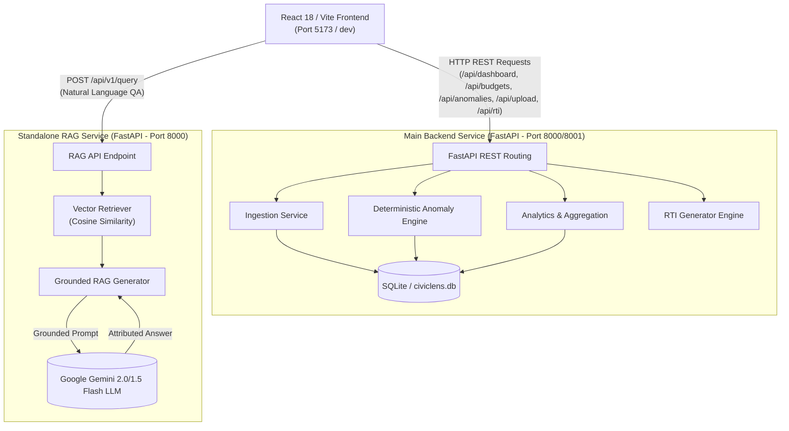

# CivicLens

> **Intelligent Public Governance & Automated Financial Audit Platform**  
> Democratizing government budget data through real-time ledger analytics, deterministic anomaly detection, grounded RAG assistant workflows, and 1-click legal RTI petition generation.

---

## 1. Project Overview

**CivicLens** is an open public-finance intelligence platform engineered to transform raw, fragmented government expenditure data into accessible, explainable, and verifiable insights for citizens, auditors, journalists, and policy analysts.

Traditional open-budget portals rely on static PDF gazettes or passive charts that show **what** money was allocated, but fail to highlight **where** variances occur, **why** spending behavior changes, or **how** ordinary citizens can take action when anomalies are detected. CivicLens addresses this challenge by shifting the paradigm:

$$\text{Static Data Dashboards} \longrightarrow \text{Automated Financial Intelligence + Grounded AI Audit + Legal Citizen Action}$$

By combining a **deterministic financial analytics engine** (FastAPI + SQLite DB), a **standalone Grounded RAG service** (Gemini 2.0/1.5 Flash + Vector Search), a **multilingual voice-enabled React UI**, and an **automated Right to Information (RTI) petition generator**, CivicLens enables citizens to monitor department outlays, inspect line-item contractor tenders, detect fiscal anomalies, and convert audit flags into formal legal petitions in seconds.

---

## 2. Problem Statement

Public financial management across government sectors faces critical transparency and oversight barriers:

* **High Volume & Complexity**: Municipal and national budget ledgers span thousands of line items in technical terminology, making citizen oversight unfeasible.
* **Hidden Fiscal Anomalies**: Cost overruns, unexpected YoY expenditure spikes, and severe budget under-utilization frequently go unnoticed until formal audit cycles complete months later.
* **Unexplainable Data**: Citizens and journalists lack tools to understand *why* department allocations shift or *which* vendor contracts drive spending surges.
* **Fragmented Evidence**: Official financial gazettes, policy briefs, and Comptroller and Auditor General (CAG) audit reports exist as disconnected documents.
* **Lack of Grounded QA & Action**: General-purpose AI chatbots hallucinate financial figures when querying public data without strict document grounding, and traditional portals provide no actionable next steps for citizens to demand accountability.

---

## 3. Solution

CivicLens bridges data ingestion, analytical auditing, grounded AI discovery, and citizen action through a structured 5-step workflow:

```
[ Government CSV / Ledger Ingestion ] ──────► [ Deterministic Anomaly Engine ]
                  │                                         │
                  ▼                                         ▼
   [ Relational Database (SQLite) ] ◄───────► [ Grounded RAG Service (Gemini) ]
                  │                                         │
                  ▼                                         ▼
   [ Citizen Dashboard & Explorer ] ◄──────────► [ AI Alerts & Evidence Audit ]
                                                            │
                                                            ▼
                                             [ 1-Click RTI Petition Generator ]
```

1. **Ingestion & Data Normalization**: Ingests CSV expenditure files and document records into a structured relational data layer with instant schema validation.
2. **Deterministic Anomaly Detection**: Automatically scans budget records for statistical anomalies (YoY spikes $\ge +40\%$, severe budget drops $\le -40\%$, over-budget execution ratios $> 1.5$).
3. **Vector Retrieval & Grounded Synthesis**: Embeds policy documents and indexes chunks for cosine-similarity semantic retrieval, generating answers backed by verifiable source citations.
4. **Citizen-First Multilingual Interface**: Simplifies public finance concepts into plain language with 10 Indian language localizations, voice interaction, and "My District" locality search.
5. **Direct Legal Action**: Allows citizens to transform any flagged financial anomaly into a pre-filled, legally formatted Right to Information (RTI) petition ready for submission to Public Information Officers (PIOs).

---

## 4. Key Features

### 📊 Citizen Dashboard (`/dashboard`)
* **Aggregate Fiscal KPIs**: Displays total budget outlay, actual expenditure, remaining funds, and percentage budget utilization.
* **Expenditure Trajectory**: Recharts AreaChart comparing allocated targets vs actual disbursements across fiscal years.
* **Sector Outlay Distribution**: Recharts PieChart visualization mapping percentage shares across key sectors (Education, Healthcare, Infrastructure, Agriculture, etc.).
* **Department Financial Ledger**: Detailed table providing scheme counts, allocation metrics, spent amounts, and progress bars for budget utilization.

### 🔍 Line-Item Budget Explorer (`/budget-explorer`)
* **Granular Scheme Audit**: Explore individual government scheme allocations, localities, categories, and contractor tenders.
* **Multi-Parametric Filtering**: Live search input with real-time filtering by department, category, and budget execution status.
* **Allocation Comparison**: Interactive Recharts BarChart comparing budget vs actual spend per scheme.
* **Scheme Ledger Dossiers**: Modal popup showing vendor names, outlay breakdowns, and source document hashes (`GET /api/budgets/dossier/{id}`).
* **Filtered CSV Export**: One-click client-side export of filtered line items for offline analysis.

### 🛡️ AI Anomaly & Fraud Monitor (`/ai-alerts`)
* **Real-Time Threat Feed**: Algorithmic risk flags classified by severity (`HIGH`, `MEDIUM`, `LOW`).
* **KPI Threat Counters**: High-visibility counters for active critical threats, velocity warnings, and resolved flags.
* **AI Investigation Dossier**: Inspects anomaly root causes, previous vs current values, percentage variances, and AI investigation findings (`GET /api/investigations/{id}`).
* **Status Workflow**: Interactive state transitions (`ACTIVE` $\rightarrow$ `UNDER_REVIEW` $\rightarrow$ `RESOLVED`).
* **Direct RTI Escalation**: 1-click transition from an active anomaly flag directly into the RTI Petition Generator with pre-populated field context.

### 🤖 Grounded Multilingual AI Assistant (`/ai-assistant`)
* **Natural-Language Policy Querying**: Ask questions about public budget allocations and receive grounded, plain-language responses.
* **Verified Source Attribution**: Displays document title, page number, and department metadata for every key claim.
* **Confidence & Evidence Rating**: Indicates confidence ratings based on retrieved chunk density.
* **Voice & 10-Language Support**: Interactive speech recognition and instant translation across 10 Indian languages.

### 📜 Legal RTI Petition Generator (`/rti-generator`)
* **Automated Filing Drafts**: Generates legally structured RTI applications under Section 6(1) of the Right to Information Act, 2005.
* **Auto-Populated Context**: Pulls department names, scheme codes, fiscal years, and specific anomaly variance figures automatically from alert flags.
* **Print & Export**: One-click PDF print/save functionality and clipboard text copying for quick mailing to Public Information Officers.

### 📥 Admin Data Ingestion Portal (`/admin-upload`)
* **Multipart File Ingestion**: Admin-authenticated drag-and-drop CSV file uploader sending real `multipart/form-data` to `POST /api/upload`.
* **Automated Anomaly Scan**: Triggers the deterministic anomaly engine automatically upon dataset ingestion.
* **Live Ingestion Feedback**: Displays server response parameters: `records_ingested`, `departments_created`, `schemes_created`, and `anomalies_detected`.
* **Live CSV Preview**: Displays extracted table rows directly in the browser before final publication.

---

## 5. System Architecture

CivicLens is built as a decoupled microservices architecture with three distinct runtime services:



---

## 🔄 Application & Data Flow

```mermaid
sequenceDiagram
    autonumber
    actor Admin as Admin / Auditor
    actor User as Citizen / Journalist
    participant FE as React Frontend (:3001)
    participant BE as FastAPI Backend (:8001)
    participant DB as Database (SQLite/Postgres)
    participant RAG as RAG Service (:8000)
    participant LLM as Gemini AI

    rect rgb(15, 23, 42)
        note right of Admin: Data Ingestion & Audit Flow
        Admin->>FE: Upload Budget CSV
        FE->>BE: POST /api/upload (multipart/form-data)
        BE->>DB: Ingest Department, Scheme & Budget Records
        BE->>BE: Run Anomaly Detection Engine
        BE->>DB: Store Detected Anomaly Flags
        BE-->>FE: Return Ingestion & Anomaly Metrics Summary
    end

    rect rgb(11, 15, 25)
        note right of User: Natural Language Discovery Flow
        User->>FE: Submit Question ("Why has healthcare budget increased?")
        FE->>RAG: POST /api/v1/query { query, top_k: 4 }
        RAG->>RAG: Vector Similarity Retrieval over Policy Chunks
        RAG->>LLM: Generate Grounded Answer with Context & Rules
        LLM-->>RAG: Synthesized Answer + Citation Metadata
        RAG-->>FE: Return { answer, sources, confidence }
        FE-->>User: Render Attributed Answer & Source Badges
    end
```



---

## 🧠 RAG & AI Architecture

The RAG service (`/RAG`) operates independently from the main backend to ensure zero-latency isolation between transactional CRUD endpoints and intensive vector computation:

* **Vector Retrieval**: Implements cosine-similarity search over document chunks (`VectorRetriever`). Supports optional `department_filter` parameters.
* **Grounded Prompt Construction**: `GroundedRAGGenerator` wraps user queries with retrieved context chunks and strict system constraints requiring source attribution.
* **Model Engine**: Powered by Google Generative AI (`gemini-2.0-flash` / `gemini-1.5-flash`).
* **Graceful Synthesis Fallback**: If Gemini API credentials are absent during offline evaluation, the service executes deterministic context synthesis to prevent runtime crashes.

### RAG API Endpoint Specification

**Request (`POST http://127.0.0.1:8000/api/v1/query`)**:
```json
{
  "query": "How much budget was allocated for healthcare in FY2026?",
  "top_k": 4,
  "department_filter": "Healthcare"
}
```

**Response**:
```json
{
  "answer": "Healthcare spending increased by 18% to ₹2,850 Cr in FY2026, primarily driven by the District Hospital Expansion Mission...",
  "sources": [
    {
      "document": "Healthcare_Budget_Brief_2026.pdf",
      "page": 4,
      "department": "Healthcare",
      "excerpt": "District Hospital Expansion Mission allocated ₹2,040 Cr..."
    }
  ],
  "confidence": "HIGH"
}
```

---

## ⚙️ Deterministic Anomaly Engine Rules

The backend anomaly engine (`app/services/anomaly_engine.py`) applies five mathematical rules to flag suspicious budget records:

$$\text{YoY Change (\%)} = \frac{\text{Actual}_{\text{curr}} - \text{Actual}_{\text{prev}}}{\text{Actual}_{\text{prev}}} \times 100$$

1. **YoY Spending Spike**:
   * `MODERATE`: $+20\% \le \text{YoY} < +40\%$
   * `HIGH`: $\text{YoY} \ge +40\%$
2. **YoY Spending Drop**:
   * `MODERATE`: $-40\% < \text{YoY} \le -20\%$
## 6. Technology Stack

| Layer | Technology | Details |
| :--- | :--- | :--- |
| **Frontend UI** | React 18, Vite | React Router DOM v6, Recharts v2, Tailwind CSS v3 |
| **Icons & Design** | Lucide React | Clean, high-contrast, accessible UI design system |
| **Main Backend** | FastAPI, Python 3.10+ | REST endpoints, CORS middleware, Uvicorn server |
| **Database** | SQLite (`civiclens.db`) | SQLAlchemy ORM models & auto-seeding engine |
| **AI & RAG** | Gemini 2.0/1.5 Flash | Standalone RAG FastAPI service with cosine vector retrieval |
| **Testing** | Pytest | Full test suite for backend API routes & RAG services |
| **Deployment** | Standard Node.js / Python | Multi-terminal local dev or Docker containerization |

---

## 7. Project Structure

```
CivicLens/
├── Frontend/                           # React 18 / Vite Frontend Application
│   ├── public/                         # Public static assets & favicon
│   ├── src/
│   │   ├── components/                 # Reusable UI components (Navbar, Footer, StatCard, etc.)
│   │   ├── context/                    # AuthContext & ThemeContext
│   │   ├── data/                       # Reference mock fallback datasets
│   │   ├── i18n/                       # 10 Indian Language translations & LanguageContext
│   │   ├── pages/                      # Home, Dashboard, BudgetExplorer, AIAssistant, AIAlerts, AdminUpload, RTIGenerator
│   │   ├── services/                   # API client layer (governmentApi, budgetService, ragService)
│   │   ├── App.jsx                     # Router & layout shell
│   │   └── main.jsx                    # React DOM mounting entrypoint
│   ├── package.json                    # Dependencies & build scripts
│   └── vite.config.js                  # Vite configuration & proxy rules
├── backend/                            # Main Analytical FastAPI Backend
│   ├── app/
│   │   ├── db/                         # SQLAlchemy session & base definitions
│   │   ├── models/                     # Database ORM models (BudgetRecord, Department, Scheme, Anomaly, AIInvestigation)
│   │   ├── routes/                     # API routers (health, dashboard, departments, schemes, budgets, anomalies, upload, rti, assistant)
│   │   ├── schemas/                    # Pydantic request/response schemas
│   │   ├── services/                   # Ingestion, anomaly engine, seed service, analytics
│   │   ├── config.py                   # Environment settings & defaults
│   │   └── main.py                     # FastAPI app initialization & CORS middleware
│   ├── tests/                          # Automated Pytest test suite (78 tests)
│   ├── .env.example                    # Backend environment configuration template
│   └── requirements.txt                # Python backend dependencies
├── RAG/                                # Standalone Grounded RAG Service
│   ├── app/
│   │   ├── api/v1/                     # RAG v1 endpoints (query, ingest, health)
│   │   ├── rag/                        # Chunking, vector retrieval, grounded generator
│   │   ├── schemas/                    # RAG request & response Pydantic models
│   │   └── main.py                     # RAG service FastAPI entrypoint
│   ├── app/tests/                      # RAG unit & integration pytest suite (42 tests)
│   └── .env.example                    # RAG environment configuration template
├── civiclens.db                        # SQLite database baseline
└── README.md                           # Master Documentation
```

---

## 8. Installation

Open Windows PowerShell (or terminal of choice) in the project workspace:

### 1. Clone Repository
```powershell
git clone https://github.com/pranjalgupta1130/CivicLens.git
cd CivicLens
```

### 2. Install Frontend Dependencies
```powershell
cd Frontend
npm install
cd ..
```

### 3. Setup Main Backend Environment
```powershell
cd backend
python -m venv venv
.\venv\Scripts\Activate.ps1
pip install -r requirements.txt
cd ..
```

### 4. Setup RAG Service Environment
```powershell
cd RAG
# If using shared python environment or virtual environment:
pip install -r requirements.txt
cd ..
```

---

## 9. Environment Variables

### `backend/.env` (Backend Configuration)
```env
PROJECT_NAME="CivicLens Backend API"
ENV=development
API_V1_STR=/api
DATABASE_URL=sqlite:///./civiclens.db
SUPABASE_URL=
SUPABASE_ANON_KEY=
```
* `PROJECT_NAME`: Title exposed in OpenAPI docs.
* `DATABASE_URL`: Connection string for SQLite or PostgreSQL storage.
* `API_V1_STR`: API route prefix (`/api`).

```

## 10. Running the Application

For a complete local development run, open 3 separate PowerShell terminals:

### Terminal 1: RAG Service (Port 8000)
```powershell
cd RAG
$env:PYTHONPATH="."
uvicorn app.main:app --host 127.0.0.1 --port 8000 --reload
```
* Swagger API Docs: `http://127.0.0.1:8000/docs`

### Terminal 2: Main Analytical Backend (Port 8001)
```powershell
cd backend
$env:PYTHONPATH="."
uvicorn app.main:app --host 127.0.0.1 --port 8001 --reload
```
* Swagger API Docs: `http://127.0.0.1:8001/docs`

### Terminal 3: React Frontend Web App (Port 5173 / 3000)
```powershell
cd Frontend
npm run dev
```
* Web Application UI: `http://localhost:5173` (Vite dev server)

---

## 11. API Overview

### Main Backend Endpoints (`http://127.0.0.1:8001/api`)

* `GET /api/health` — System and database health status check.
* `GET /api/dashboard` — Dashboard KPIs, total allocated/spent amounts, top spenders, yearly trends.
* `GET /api/departments` — List all department ledgers with allocated and actual spending totals.
* `GET /api/schemes` — List government scheme outlays filtered by department.
* `GET /api/budgets` — Granular budget line items with filters (`department_id`, `scheme_id`, `locality`, `category`).
* `GET /api/budgets/dossier/{id}` — Scheme ledger dossier with contractor info, vendor outlays, and source verification hashes.
* `GET /api/anomalies` — Detected spending anomalies with severity levels (`HIGH`, `MEDIUM`, `LOW`).
* `GET /api/investigations/{id}` — Detailed AI root-cause investigation dossier for an anomaly flag.
* `POST /api/upload` — Multipart CSV budget ingestion, auto-seeding, and instant anomaly trigger.
* `POST /api/rti/generate` — Automated legal RTI petition generator under RTI Act 2005.
* `POST /api/assistant` — Multilingual RAG conversational query handler.

### RAG Service Endpoints (`http://127.0.0.1:8000/api/v1`)

* `GET /api/v1/health` — RAG service health check.
* `POST /api/v1/query` — Grounded RAG query execution over document chunks with citation output.
* `POST /api/v1/ingest/csv` — CSV policy chunk indexing into vector retriever.

---

## 12. Data Flow

### CSV Ingestion & Anomaly Audit Pipeline
$$\text{CSV Upload} \longrightarrow \text{Backend Ingestion} \longrightarrow \text{DB Persistence} \longrightarrow \text{Deterministic Anomaly Rules} \longrightarrow \text{Alert Notifications}$$

1. Admin uploads budget CSV via `/admin-upload`.
2. Backend parses records into `BudgetRecord`, `Department`, and `Scheme` tables.
3. Deterministic Anomaly Engine evaluates mathematical spike ($\ge +40\%$), drop ($\le -40\%$), and overbudget ($> 1.5$) thresholds.
4. Anomaly flags are saved to DB and immediately broadcast to the Dashboard and AI Alerts feed.

### Grounded Citizen Discovery & Legal RTI Action Flow
$$\text{Citizen Prompt / Flag} \longrightarrow \text{RAG Vector Retrieval} \longrightarrow \text{Attributed AI Response} \longrightarrow \text{1-Click RTI Generation} \longrightarrow \text{Legal Petition}$$

1. Citizen enters a prompt or inspects an alert flag on `/ai-alerts`.
2. Grounded RAG retrieves policy chunks and presents evidence-backed answers.
3. If suspicious spending requires formal inquiry, citizen clicks "Create RTI Petition".
4. System auto-generates a Section 6(1) RTI legal application with pre-populated evidence ready to print/submit.

---

## 13. AI Safety & Grounding

To guarantee public trustworthiness and prevent hallucinations:

* **Document Grounding**: RAG response context is restricted strictly to retrieved government ledger chunks.
* **Verifiable Source Attribution**: Every claim displays exact source document, page, and department badges.
* **Confidence & Evidence Scoring**: Low-confidence responses explicitly prompt users to consult primary gazette files.
* **Deterministic Fallback**: If LLM API connectivity is unavailable, the application synthesizes exact database ledger figures without hallucination.

---

## 14. Testing

### Automated Test Execution Commands

```powershell
# 1. Main Backend Test Suite (78 Tests)
$env:PYTHONPATH="backend"
pytest backend/tests backend/app/ai/tests -q

# 2. Standalone RAG Service Test Suite (42 Tests)
$env:PYTHONPATH="RAG"
pytest RAG -q

# 3. Frontend Production Build Check
npm run build --prefix Frontend
```

### Verified Test Results
* **Backend Unit & Integration Tests**: `78 passed` (100% pass rate).
* **RAG Unit & Integration Tests**: `42 passed` (100% pass rate).
* **Frontend Vite Build**: Successfully compiled dist bundle without errors.

---

## 15. Screenshots / Hackathon Demo Flow

Recommended demonstration path for hackathon evaluation:

1. **Home (`/`)**: 5-Step Citizen Workflow, 2 Primary CTAs, "My District" search, and Key Sectors overview.
2. **Dashboard (`/dashboard`)**: Total budget KPIs, Recharts YoY area trends, sector PieChart breakdown, and plain-language tooltips.
3. **Budget Explorer (`/budget-explorer`)**: Filter schemes, open contractor dossier modal, and export CSV.
4. **AI Alerts (`/ai-alerts`)**: Active threat feed, inspect root-cause analysis, and click "File RTI Petition".
5. **RTI Generator (`/rti-generator`)**: Pre-populated legal application under Section 6(1) of RTI Act 2005 ready for printing.
6. **AI Assistant (`/ai-assistant`)**: Multilingual voice/text query with source citation badges.
7. **Admin Upload (`/admin-upload`)**: Authenticate, upload CSV budget data, and inspect real-time anomaly detection output.

---

## 16. Future Scope

* **Geospatial Mapping**: Interactive district map layer showing geographic infrastructure disbursements.
* **Scanned PDF OCR**: Automated table extraction from scanned municipal gazette PDFs.
* **Predictive Outlay ML**: Forecasting fiscal year-end budget utilization velocity.
* **Direct PIO Directory**: Mapping target departments to regional Public Information Officer contact endpoints.

---

## 17. Limitations

1. **SQLite Default**: Local environment defaults to SQLite (`civiclens.db`) for instant testing; Supabase pgvector is configured for production scale.
2. **CSV Header Standard**: Uploaded CSV files require standard column names (`department_name`, `scheme_name`, `budget_amount`, `actual_amount`, `year`).
3. **Web Speech API**: Voice recognition relies on browser Web Speech API availability.

---

## 18. License & Disclaimer

**CivicLens** is an open-source public intelligence platform developed for transparency, research, and civic engagement.

* **License**: MIT License.
* **Disclaimer**: CivicLens AI risk scores and anomaly notifications are algorithmic screening indicators designed to assist human auditors and citizens. They do not constitute formal legal findings of fraud without independent audit verification.

