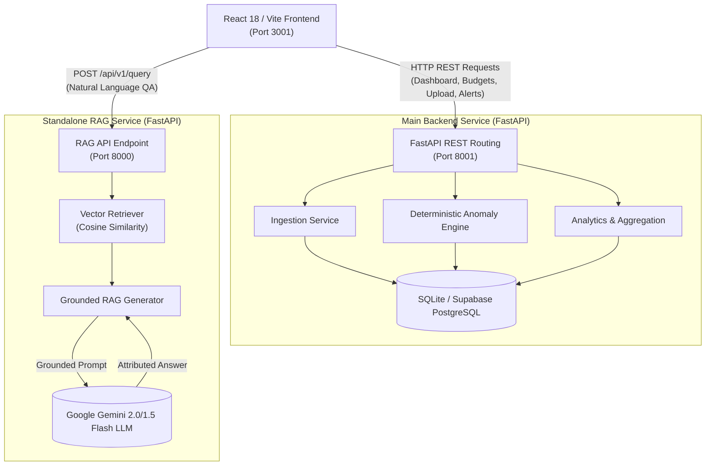

# CivicLens

> **Intelligent Public Governance & Automated Financial Audit Platform**  
> Democratizing government budget data through real-time ledger analytics, deterministic anomaly detection, and evidence-grounded AI assistant workflows.

---

## 🌟 Overview

**CivicLens** is an open public-finance intelligence system engineered to transform raw, fragmented government expenditure data into accessible, explainable, and verifiable insights for citizens, auditors, journalists, and policy analysts.

Traditional open-budget portals rely on static PDF gazettes or passive charts that show **what** money was allocated, but fail to highlight **where** variances occur or **why** spending behavior changes. CivicLens addresses this challenge by shifting the paradigm:

$$\text{Static Data Dashboards} \longrightarrow \text{Automated Financial Intelligence + Grounded AI Audit}$$

By combining a **deterministic financial analytics engine** (FastAPI + SQLite/PostgreSQL) with a **standalone Grounded RAG service** (Gemini 2.0/1.5 Flash + Vector Search), CivicLens enables users to monitor department outlays, inspect line-item contractor tenders, detect fiscal anomalies, and query public policy ledgers in natural language with source-attributed evidence.

---

## 🎯 Problem Statement

Public financial management across government sectors faces critical transparency and oversight barriers:

* **High Volume & Complexity**: Municipal and national budget ledgers span thousands of line items, making manual oversight unfeasible.
* **Hidden Fiscal Anomalies**: Cost overruns, unexpected YoY expenditure spikes, and severe budget under-utilization frequently go unnoticed until formal audit cycles complete months later.
* **Unexplainable Data**: Citizens and journalists lack tools to understand *why* department allocations shift or *which* vendor contracts drive spending surges.
* **Fragmented Evidence**: Official financial gazettes, policy briefs, and CAG (Comptroller and Auditor General) audit reports exist as disconnected PDF documents.
* **Lack of Grounded QA**: General-purpose AI chatbots hallucinate financial figures when querying public data without strict document grounding.

---

## 💡 The CivicLens Solution

CivicLens bridges data ingestion, analytical auditing, and conversational discovery through a structured multi-tier workflow:

```
[ Government Data / CSV / PDF ] 
             │
             ├──► [ Backend Ingestion Service ] ──► [ Deterministic Anomaly Engine ]
             │                                                  │
             │                                                  ▼
             ├──► [ Vector Indexing Pipeline ] ──────► [ Financial Ledger Database ]
             │                                                  │
             ▼                                                  ▼
[ Grounded RAG Service (Gemini) ] ◄──────────────► [ React Financial Dashboard ]
             │                                                  │
             ▼                                                  ▼
[ Verifiable Conversational Answers ] ◄───────► [ Line-Item Budget Audit Dossiers ]
```

1. **Ingestion & Data Normalization**: Ingests CSV expenditure files and document records into a structured SQLite/PostgreSQL data layer.
2. **Deterministic Anomaly Detection**: Automatically scans budget records for statistical anomalies (YoY spikes $\ge +40\%$, severe budget drops $\le -40\%$, over-budget execution ratios $> 1.5$).
3. **Vector Retrieval & Grounded Synthesis**: Embeds policy documents and indexes chunks for cosine-similarity semantic retrieval, generating answers backed by verifiable source citations.
4. **Interactive Audit Dashboard**: Presents real-time financial metrics, Recharts visual analytics, line-item filtering, and AI alert feeds via a responsive React/Vite web application.

---

## ✨ Key Features

### 📊 Executive Financial Dashboard (`/dashboard`)
* **Aggregate Fiscal KPIs**: Displays total budget outlay, actual expenditure, active department counts, and high-severity anomaly metrics.
* **Expenditure Trajectory**: Multi-year Recharts AreaChart comparing allocated targets vs actual disbursements over time.
* **Sector Outlay Distribution**: Recharts PieChart visualization mapping percentage shares across departments (Education, Healthcare, Infrastructure, Agriculture, etc.).
* **Department Financial Ledger**: Detailed table providing scheme counts, allocation metrics, spent amounts, and progress bars for budget utilization.

### 🔍 Line-Item Budget Explorer (`/budget-explorer`)
* **Granular Scheme Audit**: Explore individual government scheme allocations, localities, and categories.
* **Multi-Parametric Filtering**: Live search input with real-time filtering by department, category, and budget status.
* **Allocation Comparison**: Interactive Recharts BarChart comparing budget vs actual spend per scheme.
* **Scheme Ledger Dossiers**: Modal popup showing vendor names, outlay breakdowns, and source document hashes.
* **Filtered CSV Export**: One-click client-side export of filtered line items for offline analysis.

### 🛡️ AI Anomaly & Fraud Monitor (`/ai-alerts`)
* **Real-Time Threat Feed**: Algorithmic risk flags classified by severity (`HIGH`, `MEDIUM`, `LOW`).
* **KPI Threat Counters**: High-visibility counters for active critical threats, velocity warnings, and resolved flags.
* **Audit Detail Modal**: Inspects anomaly root causes, previous vs current values, percentage variances, and AI investigation findings.
* **Status Workflow**: Interactive state transitions (`ACTIVE` $\rightarrow$ `UNDER_REVIEW` $\rightarrow$ `RESOLVED`).

### 🤖 Grounded AI Assistant (`/ai-assistant`)
* **Natural-Language Policy Querying**: Ask questions about public budget allocations and receive grounded responses.
* **Verified Source Attribution**: Displays document title, page number, and department metadata for every key claim.
* **Confidence Rating**: Indicates confidence scores (`HIGH`, `MODERATE`, `LOW`) based on retrieved chunk density.
* **Interactive Quick Prompts**: One-click sample questions for instant platform exploration.

### 📥 Admin Data Ingestion Portal (`/admin-upload`)
* **Multipart File Ingestion**: Drag-and-drop CSV file uploader sending real `multipart/form-data` to `POST /api/upload`.
* **Automated Anomaly Scan**: Triggers the deterministic anomaly engine automatically upon successful dataset ingestion.
* **Live Server Feedback**: Displays actual backend response parameters: `records_ingested`, `departments_created`, `schemes_created`, and `anomalies_detected`.
* **Live CSV Preview**: Displays extracted table rows directly in the browser before final publication.

---

## 🏛️ System Architecture

CivicLens is built as a decoupled microservices architecture with three distinct layers:



---

## 🔄 Application & Data Flow

```mermaid
sequenceDiagram
    autonumber
    actor Admin as Admin / Auditor
    actor User as Citizen / Journalist
    participant FE as React Frontend (:3001)
    participant BE as FastAPI Backend (:8001)
    participant DB as Database (SQLite/Postgres)
    participant RAG as RAG Service (:8000)
    participant LLM as Gemini AI

    rect rgb(15, 23, 42)
        note right of Admin: Data Ingestion & Audit Flow
        Admin->>FE: Upload Budget CSV
        FE->>BE: POST /api/upload (multipart/form-data)
        BE->>DB: Ingest Department, Scheme & Budget Records
        BE->>BE: Run Anomaly Detection Engine
        BE->>DB: Store Detected Anomaly Flags
        BE-->>FE: Return Ingestion & Anomaly Metrics Summary
    end

    rect rgb(11, 15, 25)
        note right of User: Natural Language Discovery Flow
        User->>FE: Submit Question ("Why has healthcare budget increased?")
        FE->>RAG: POST /api/v1/query { query, top_k: 4 }
        RAG->>RAG: Vector Similarity Retrieval over Policy Chunks
        RAG->>LLM: Generate Grounded Answer with Context & Rules
        LLM-->>RAG: Synthesized Answer + Citation Metadata
        RAG-->>FE: Return { answer, sources, confidence }
        FE-->>User: Render Attributed Answer & Source Badges
    end
```



---

## 🧠 RAG & AI Architecture

The RAG service (`/RAG`) operates independently from the main backend to ensure zero-latency isolation between transactional CRUD endpoints and intensive vector computation:

* **Vector Retrieval**: Implements cosine-similarity search over document chunks (`VectorRetriever`). Supports optional `department_filter` parameters.
* **Grounded Prompt Construction**: `GroundedRAGGenerator` wraps user queries with retrieved context chunks and strict system constraints requiring source attribution.
* **Model Engine**: Powered by Google Generative AI (`gemini-2.0-flash` / `gemini-1.5-flash`).
* **Graceful Synthesis Fallback**: If Gemini API credentials are absent during offline evaluation, the service executes deterministic context synthesis to prevent runtime crashes.

### RAG API Endpoint Specification

**Request (`POST http://127.0.0.1:8000/api/v1/query`)**:
```json
{
  "query": "How much budget was allocated for healthcare in FY2026?",
  "top_k": 4,
  "department_filter": "Healthcare"
}
```

**Response**:
```json
{
  "answer": "Healthcare spending increased by 18% to ₹2,850 Cr in FY2026, primarily driven by the District Hospital Expansion Mission...",
  "sources": [
    {
      "document": "Healthcare_Budget_Brief_2026.pdf",
      "page": 4,
      "department": "Healthcare",
      "excerpt": "District Hospital Expansion Mission allocated ₹2,040 Cr..."
    }
  ],
  "confidence": "HIGH"
}
```

---

## ⚙️ Deterministic Anomaly Engine Rules

The backend anomaly engine (`app/services/anomaly_engine.py`) applies five mathematical rules to flag suspicious budget records:

$$\text{YoY Change (\%)} = \frac{\text{Actual}_{\text{curr}} - \text{Actual}_{\text{prev}}}{\text{Actual}_{\text{prev}}} \times 100$$

1. **YoY Spending Spike**:
   * `MODERATE`: $+20\% \le \text{YoY} < +40\%$
   * `HIGH`: $\text{YoY} \ge +40\%$
2. **YoY Spending Drop**:
   * `MODERATE`: $-40\% < \text{YoY} \le -20\%$
   * `HIGH`: $\text{YoY} \le -40\%$
3. **Over-Budget Execution**:
   * Flagged when ratio $V = \frac{\text{Actual}}{\text{Budget}} > 1.5$ (exceeding budget by over 50%).
4. **Unannounced New Allocation**:
   * Flagged when previous year actual spend was 0 and current spend is $> 0$.
5. **Multi-Year Baseline Deviation**:
   * Flagged when allocation deviates by $> 50\%$ from the 3-year historical moving average.

---

## 🛠️ Technology Stack

| Layer | Technology | Version / Details |
| :--- | :--- | :--- |
| **Frontend UI** | React | `^18.2.0` |
| **Build Tool** | Vite | `^5.1.4` |
| **Routing** | React Router DOM | `^6.22.0` |
| **Data Visualization** | Recharts | `^2.12.0` |
| **Icons & Design** | Lucide React / TailwindCSS | `^0.344.0` / `^3.4.1` |
| **API Client** | Native `fetch` | Centralized service layer (`src/services/api.js`) |
| **Main Backend Framework** | FastAPI (Python) | `^0.109.0` |
| **ORM & Database** | SQLAlchemy / SQLite / PostgreSQL | `civiclens.db` local SQLite / Supabase pgvector |
| **Validation & Settings** | Pydantic v2 / BaseSettings | `^2.6.1` |
| **RAG AI Service** | FastAPI + Google Generative AI | `google-generativeai`, `python-dotenv` |
| **Server Runner** | Uvicorn | `uvicorn --port 8001 / 8000` |

---

## 📡 API Endpoint Reference

### Main Backend Endpoints (`http://127.0.0.1:8001/api`)

| Method | Endpoint | Purpose | Query Parameters / Body | Response Model |
| :--- | :--- | :--- | :--- | :--- |
| `GET` | `/api/health` | Service health status check | None | `{ status, project }` |
| `GET` | `/api/dashboard` | Dashboard KPIs, top spenders, yearly trend | None | `DashboardSummary` |
| `GET` | `/api/departments` | List all departments with budget totals | None | `list[DepartmentSummary]` |
| `GET` | `/api/departments/{id}` | Detailed department information | `id` (path) | `DepartmentOut` |
| `GET` | `/api/schemes` | List government schemes | `department_id` (optional) | `list[SchemeOut]` |
| `GET` | `/api/budgets` | Filter raw budget line-items | `department_id`, `scheme_id`, `year`, `locality`, `category` | `list[BudgetRecordOut]` |
| `GET` | `/api/budgets/{id}` | Detailed budget line-item record | `id` (path) | `BudgetRecordOut` |
| `GET` | `/api/anomalies` | List detected financial anomalies | `severity`, `department_id`, `year` | `list[AnomalyOut]` |
| `GET` | `/api/anomalies/{id}` | Single anomaly record details | `id` (path) | `AnomalyOut` |
| `POST` | `/api/compare` | Multi-year historical trend engine | `{ department_id, start_year, end_year, scheme_id }` | `CompareYearsResponse` |
| `POST` | `/api/upload` | Multipart CSV budget file ingestion | `file` (`multipart/form-data`) | `{ status, records_ingested, ... }` |
| `POST` | `/api/analyze` | Trigger deterministic anomaly detection | `{ year, department_id }` | `AnalyzeResponse` |
| `GET` | `/api/investigations/{id}`| Fetch AI investigation for anomaly | `id` (path) | `AIInvestigationOut` |
| `POST` | `/api/investigations` | Store AI investigation findings | `AIInvestigationCreate` | `AIInvestigationOut` |

### RAG Service Endpoints (`http://127.0.0.1:8000/api/v1`)

| Method | Endpoint | Purpose | Request Body | Response Model |
| :--- | :--- | :--- | :--- | :--- |
| `GET` | `/api/v1/health` | RAG service health check | None | `{ status: "ok" }` |
| `POST` | `/api/v1/query` | Execute Grounded RAG Query | `{ query, top_k, department_filter }` | `QueryResponse` |
| `POST` | `/api/v1/ingest/pdf` | Index PDF policy documents | `file` (`multipart/form-data`) | `IngestionResponse` |
| `POST` | `/api/v1/ingest/csv` | Index CSV document chunks | `file` (`multipart/form-data`) | `IngestionResponse` |

---

## 💻 Local Setup & Development Guide

### Prerequisites
* **Node.js**: `v18.x` or higher
* **Python**: `3.10` or higher
* **npm**: `v9.x` or higher

---

### Step 1: Clone Repository
```bash
git clone https://github.com/pranjalgupta1130/CivicLens.git
cd CivicLens
```

---

### Step 2: Main Backend Setup (Port 8001)
```bash
cd backend

# Create virtual environment
python -m venv venv
# On Windows:
venv\Scripts\activate
# On macOS/Linux:
# source venv/bin/activate

# Install dependencies
pip install -r requirements.txt

# Start FastAPI server on port 8001
uvicorn app.main:app --reload --port 8001
```
* **Backend API Base**: `http://127.0.0.1:8001/api`
* **Swagger API Documentation**: `http://127.0.0.1:8001/docs`

---

### Step 3: RAG Service Setup (Port 8000)
Open a new terminal window:
```bash
cd RAG

# Create virtual environment
python -m venv venv
# On Windows:
venv\Scripts\activate
# On macOS/Linux:
# source venv/bin/activate

# Install dependencies
pip install fastapi uvicorn google-generativeai python-dotenv pydantic

# Configure environment variables
cp .env.example .env
# Add your GEMINI_API_KEY in .env

# Start RAG FastAPI server on port 8000
python app/main.py
# or: uvicorn app.main:app --reload --port 8000
```
* **RAG Service API Base**: `http://127.0.0.1:8000/api/v1`
* **RAG Swagger Documentation**: `http://127.0.0.1:8000/docs`

---

### Step 4: Frontend Web App Setup (Port 3001)
Open a third terminal window:
```bash
cd Frontend

# Install Node dependencies
npm install

# Environment setup (.env.local)
# Create .env.local with:
# VITE_API_BASE_URL=http://127.0.0.1:8001/api
# VITE_RAG_BASE_URL=http://127.0.0.1:8000/api/v1

# Start Vite development server
npm run dev
```
* **Frontend Web Application**: `http://localhost:3000` (or `http://localhost:3001`)

---

### Step 5: Verify Build Output
To ensure production bundle compatibility:
```bash
cd Frontend
npm run build
```

---

## 🔐 Environment Variables Guide

> [!IMPORTANT]
> **Security Rule**: Never check secret API keys, Supabase credentials, or database passwords into version control. Use `.env.local` for frontend local overrides and `.env` for backend environments.

### `Frontend/.env.local`
```env
# Frontend API Base URLs (Local Development)
VITE_API_BASE_URL=http://127.0.0.1:8001/api
VITE_RAG_BASE_URL=http://127.0.0.1:8000/api/v1
```

### `backend/.env`
```env
PROJECT_NAME="CivicLens Backend API"
ENV=development
API_V1_STR=/api
DATABASE_URL=sqlite:///./civiclens.db
SUPABASE_URL=your_supabase_url_placeholder
SUPABASE_ANON_KEY=your_supabase_anon_key_placeholder
```

### `RAG/.env`
```env
GEMINI_API_KEY=your_gemini_api_key_placeholder
GEMINI_MODEL=gemini-1.5-flash
GEMINI_EMBEDDING_MODEL=models/text-embedding-004
PORT=8000
ENVIRONMENT=development
```

---

## 📂 Project Structure

```
CivicLens/
├── Frontend/                           # React 18 / Vite Frontend Application
│   ├── public/                         # Static assets & public icons
│   ├── src/
│   │   ├── components/                 # Reusable UI components
│   │   │   ├── Footer.jsx              # Platform footer component
│   │   │   ├── Navbar.jsx              # Header, global search & alert dropdown
│   │   │   ├── Sidebar.jsx             # Navigation sidebar with alert badge
│   │   │   └── StatCard.jsx            # Metric highlight cards
│   │   ├── data/
│   │   │   └── mockData.js             # Static reference mock data
│   │   ├── pages/                      # Application route pages
│   │   │   ├── AIAlerts.jsx            # AI Anomaly & Fraud Monitor feed
│   │   │   ├── AIAssistant.jsx         # Grounded RAG conversational interface
│   │   │   ├── AdminUpload.jsx         # CSV dataset ingestion portal
│   │   │   ├── BudgetExplorer.jsx      # Line-item budget table & BarChart
│   │   │   ├── Dashboard.jsx           # Analytics dashboard & Recharts
│   │   │   └── Home.jsx                # Platform landing overview
│   │   ├── services/
│   │   │   └── api.js                  # Centralized fetch API service client
│   │   ├── App.jsx                     # Router configuration & app shell
│   │   ├── main.jsx                    # React DOM entrypoint
│   │   └── index.css                   # Global styles & Tailwind directives
│   ├── .env.local                      # Local API environment variables
│   ├── .gitignore                      # Git exclusion rules
│   ├── index.html                      # Single-page app HTML template
│   ├── package.json                    # Frontend dependencies & scripts
│   ├── tailwind.config.js              # Tailwind styling configuration
│   └── vite.config.js                  # Vite server & build options
├── backend/                            # FastAPI Main Analytical Backend
│   ├── app/
│   │   ├── db/                         # SQLAlchemy session & base setup
│   │   │   ├── base.py
│   │   │   └── session.py
│   │   ├── models/                     # Database ORM models
│   │   │   ├── anomaly.py
│   │   │   ├── budget_record.py
│   │   │   ├── department.py
│   │   │   ├── integration.py
│   │   │   └── scheme.py
│   │   ├── routes/                     # REST API routers
│   │   │   ├── anomalies.py
│   │   │   ├── budgets.py
│   │   │   ├── compare.py
│   │   │   ├── dashboard.py
│   │   │   ├── departments.py
│   │   │   ├── health.py
│   │   │   ├── investigations.py
│   │   │   ├── schemes.py
│   │   │   └── upload.py
│   │   ├── schemas/                    # Pydantic request/response models
│   │   │   ├── anomaly.py
│   │   │   ├── budget.py
│   │   │   ├── dashboard.py
│   │   │   ├── department.py
│   │   │   ├── investigation.py
│   │   │   └── scheme.py
│   │   ├── services/                   # Business logic engines
│   │   │   ├── analytics.py
│   │   │   ├── anomaly_engine.py
│   │   │   ├── ingestion.py
│   │   │   └── seed_service.py
│   │   ├── config.py                   # App configuration & settings
│   │   └── main.py                     # FastAPI application entry & CORS
│   ├── tests/                          # Pytest integration & unit test suite
│   ├── .env.example                    # Backend environment template
│   ├── README.md                       # Backend specific documentation
│   └── requirements.txt                # Python backend dependencies
├── RAG/                                # Standalone Grounded RAG FastAPI Service
│   ├── app/
│   │   ├── api/
│   │   │   └── v1/                     # RAG v1 endpoints (query, ingest)
│   │   │       ├── health.py
│   │   │       ├── ingest.py
│   │   │       └── query.py
│   │   ├── rag/                        # RAG core pipeline modules
│   │   │   ├── chunker.py
│   │   │   ├── embeddings.py
│   │   │   ├── generator.py
│   │   │   ├── parser.py
│   │   │   └── retriever.py
│   │   ├── schemas/
│   │   │   └── rag_schemas.py
│   │   ├── dependencies.py             # Retriever & generator dependency injection
│   │   └── main.py                     # RAG service FastAPI entrypoint
│   ├── .env.example                    # RAG environment template
│   └── test_app.py                     # RAG service integration test script
└── README.md                           # Master CivicLens Documentation
```

---

## 🌟 Why CivicLens?

> *"Most government portals show what was spent. CivicLens is designed to help citizens and auditors understand what looks unusual, why it changed, and where further investigation is warranted."*

| Dimension | Traditional Open Data Portals | CivicLens Platform |
| :--- | :--- | :--- |
| **Data Format** | Static PDF gazettes or raw CSV dumps | Normalized relational database + searchable vector store |
| **Variance Analysis** | Manual comparison across fiscal years | Automated YoY variance tracking & threshold classification |
| **Anomaly Detection** | None (discovered months later during audit) | Real-time deterministic detection rules ($\ge +40\%$ spikes, overbudget spend) |
| **Querying** | Manual keyword searching in tables | Evidence-grounded natural language search via Gemini Grounded RAG |
| **Verification** | Unattributed statistics | Source-backed citation badges (document name, page number, department) |

---

## ⚠️ Current Limitations & Prototype Scope

To maintain complete transparency, the following limitations reflect the current state of the prototype:

1. **Local SQLite Default**: The primary development backend defaults to a local SQLite database (`civiclens.db`) for zero-configuration testing. Supabase PostgreSQL pgvector support is implemented in the schema layer but requires manual production credentials.
2. **In-Memory RAG Vector Store**: The local RAG service retriever utilizes in-memory vector similarity search for rapid prototyping; persistence to Supabase pgvector is supported via configuration.
3. **Manual CSV Ingestion Schema**: The CSV ingestion engine requires specific headers (`department_code`, `department_name`, `scheme_code`, `scheme_name`, `year`, `locality`, `category`, `budget_amount`, `actual_amount`).

---

## 🚀 Roadmap & Future Enhancements

* [ ] **Automated PDF Expenditure Parsing**: OCR & table extraction pipeline for official scanned municipal gazettes.
* [ ] **Contractor Entity Resolution**: Cross-referencing awarded vendors across departments to spot duplicate contractor payouts.
* [ ] **Predictive Budget Forecasting**: Time-series ML forecasting to predict mid-year budget shortfalls before quarter end.
* [ ] **Geospatial Outlay Mapping**: Map-based visual rendering of district-level municipal infrastructure investments.
* [ ] **Citizen Feedback & Reporting Workflow**: Allowing public users to submit whistleblower flags on suspicious line items.

---

## 📜 License & Disclaimer

**CivicLens** is an open-source public intelligence platform developed for transparency, research, and civic engagement.

* **License**: MIT License.
* **Disclaimer**: CivicLens AI risk scores and anomaly notifications are algorithmic screening indicators designed to assist human auditors and citizens. They do not constitute formal legal findings of fraud without independent audit verification.
